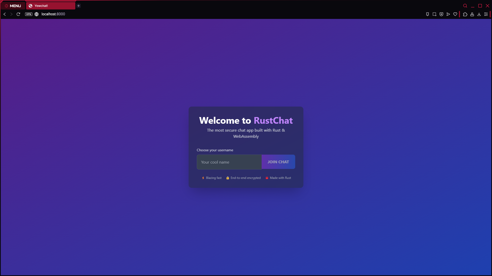
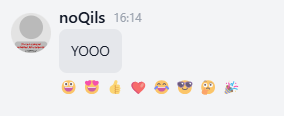
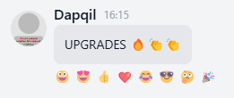
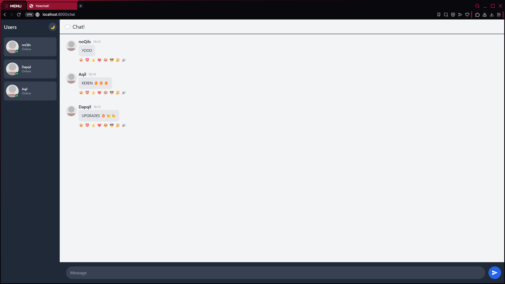
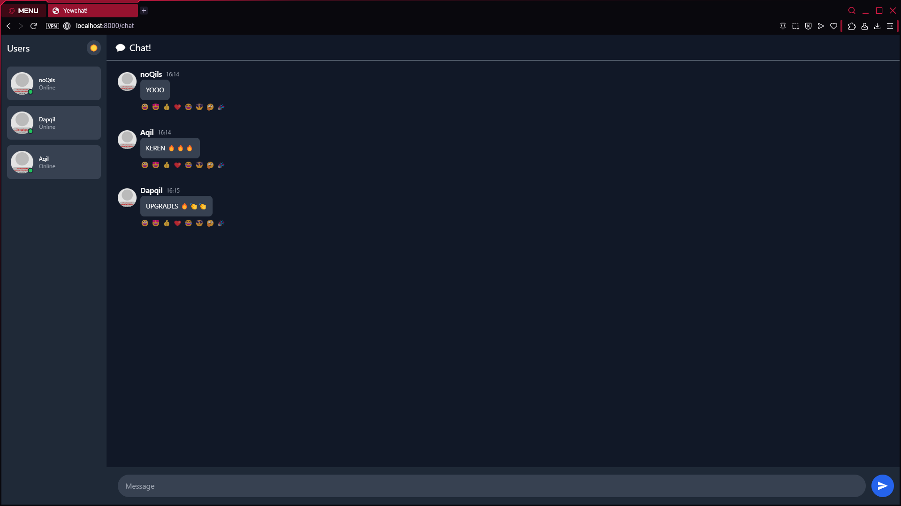

## Experiment 3.1:  Original Code

## Experiment 3.2: Be Creative!

### Enhanced Login Page

### Added Message Emoticon Reactions

### Added Emoji Support in Messages

### Light Mode

### Dark Mode

### Enhancements Explanation
#### 1. Dark/Light Mode Toggle
- Added a theme switcher button (🌙/☀️) in the user panel
- Dynamic theme switching between dark and light modes
- All UI elements adapt to the selected theme
- Theme state persists during the session

#### 2. Emoji Reactions
- Users can react to messages with emojis
- Predefined set of 8 common emojis (😀, 😍, 👍, ❤️, 😂, 😎, 🤔, 🎉)
- Reactions are displayed below messages
- Reactions are synchronized across all clients via WebSocket

#### 3. Online Status Indicators
- Visual indicators (green dot) show who's online
- User list displays "Online"/"Offline" status
- Status indicators next to user avatars

#### 4. Improved Message UI
- Added timestamps to messages
- Better message bubbles with theme-appropriate colors
- Improved spacing and layout
- Hover effects on messages

#### 5. Enhanced Login Screen
- Gradient background for visual appeal
- Blurred card effect with shadow
- Better input styling
- Improved button with gradient and hover effects
- Informational footer with app features

#### 6. Technical Improvements
- Added proper error handling for WebSocket messages
- Better state management for reactions and typing indicators
- Optimized re-rendering with proper component structure
- Added chrono for timestamp handling

#### 7. UI/UX Enhancements
- Smooth transitions for interactive elements
- Better visual hierarchy
- Improved input field with proper padding
- Consistent spacing throughout the interface
- Responsive design that works on different screen sizes